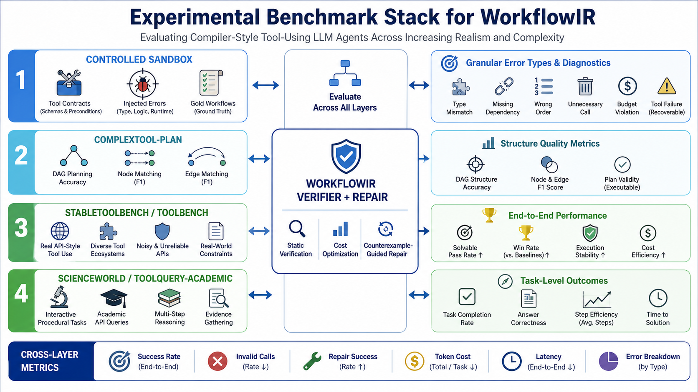

# WorkflowIR: Controlled Agent Workflows for Reliable Literature Search

This repository studies a simple but important question:

> Can explicit workflow structure make tool-using LLM agents more reliable than free-form prompting?

The first experimental domain is **academic literature search**. A free-form agent is asked to design queries, call OpenAlex, inspect retrieval counts, export papers, and write a summary. In practice, this kind of agent often times out, produces overly broad queries, misses required files, or fails to explain where the error happened. WorkflowIR turns the same task into a typed, auditable workflow so each step can be checked, repaired, and attributed.

## What This Project Is

WorkflowIR is a controlled sandbox and evaluation pipeline for multi-tool LLM agents. It represents an agent task as a small workflow graph whose nodes have:

- `schema`: what input and output must look like;
- `precondition`: what must be true before the node can run;
- `effect`: what artifact or state change the node must produce;
- `failure mode`: how errors are labeled when the node fails.

In the current literature-search benchmark, the controlled agent workflow is:

```text
plan_queries
  -> validate_query_plan
  -> dry_run_counts
  -> repair_queries
  -> full_export
  -> evaluate_results
  -> verify_contract
```

The key idea is not to let an LLM remember the whole protocol by itself. The LLM or planner can propose a search strategy, but the WorkflowIR runner enforces the contract: query count limits, dry-run inspection, broad-query repair, zero-result recovery, full OpenAlex export, required output files, and machine-readable trace logs.

## How It Works

The repository contains three connected layers.

**1. Controlled Sandbox**

`scripts/build_controlled_litsearch_sandbox.py` generates a controlled literature-search task set with tool schemas, preconditions, effects, injected failures, and attribution labels.

Output:

```text
data/controlled_sandbox/litsearch_v1/
```

**2. Real Baseline Agent Runs**

`scripts/run_real_litwatch_trials.py` runs free-form ARIS/MiniMax/OpenAlex literature-search trials. These runs collect real agent failures instead of synthetic mistakes.

In the seed run, the baseline agent produced:

```text
5/5 timeout
4/5 missing final summary
multiple broad queries
partial protocol compliance
```

Trace dataset:

```text
data/real_agent_litwatch_traces/workflowir_seed/
```

**3. WorkflowIR-Controlled Agent**

`scripts/run_workflowir_litsearch_trials.py` runs the same topic set through a controlled WorkflowIR pipeline. The runner executes deterministic OpenAlex calls, validates artifacts, repairs weak queries, and writes required reports.

Seed comparison:

```text
Baseline free-form agent:
  completion_rate = 0%
  timeout_rate    = 100%

WorkflowIR-controlled agent:
  completion_rate     = 100%
  timeout_rate        = 0%
  contract_pass_rate  = 100%
  full_export_rate    = 100%
```

Comparison report:

```text
data/workflowir_litsearch_eval/effectiveness_report.md
```

## Quick Start

Build the controlled sandbox:

```bash
python3 scripts/build_controlled_litsearch_sandbox.py
```

Run the WorkflowIR-controlled literature-search evaluation:

```bash
python3 scripts/run_workflowir_litsearch_trials.py \
  --config configs/workflowir_litsearch_trials.example.json \
  --execute \
  --max-results-per-query 50
```

Compare against the baseline batch:

```bash
python3 scripts/analyze_workflowir_litsearch_effectiveness.py \
  --baseline-batch lit-watch/trial-batches/20260505T014639Z-workflowir-real-litwatch-seed/batch_manifest.json \
  --workflowir-batch lit-watch/workflowir-batches/20260505T052451Z-workflowir-controlled-litsearch-seed/batch_manifest.json \
  --out-dir data/workflowir_litsearch_eval
```

Open the visual explanation page locally:

```text
docs/workflowir_visual_learning.html
```

GitHub Pages entry:

```text
https://zhuyingqin.github.io/WorkflowIR/
```

## Repository Map

```text
configs/                         experiment configs and prompt contracts
scripts/run_workflowir_litsearch_trials.py
                                 WorkflowIR-controlled runner
scripts/run_real_litwatch_trials.py
                                 free-form baseline agent runner
scripts/build_real_litwatch_trace_dataset.py
                                 mines real agent artifacts into trace data
scripts/build_controlled_litsearch_sandbox.py
                                 controlled synthetic sandbox generator
crates/runtime/assets/skills/openalex-search/
                                 reproducible OpenAlex search skill
data/controlled_sandbox/          controlled sandbox data
data/real_agent_litwatch_traces/  real baseline trace data
data/workflowir_litsearch_eval/   effectiveness comparison output
docs/                            visual explanation and GitHub Pages site
```

## What The Current Results Prove

The current experiment supports the claim that WorkflowIR improves **execution reliability**, **protocol compliance**, and **error attribution** for literature-search agents. It does not yet fully prove that the semantic quality of retrieved papers is always better. The next step is to add human or LLM top-k relevance grading for retrieval quality.

---

## Upstream Foundation: ARIS-Code

This project is built on top of ARIS-Code, a multi-agent research automation CLI. The original ARIS-Code overview follows below because the WorkflowIR experiments reuse its agent runtime, skills, and literature-search infrastructure.



```
    ░░░░░░░░░░░░░░░░░░░░░░░░░░░░░░░░░░░░░░░░░
    ░  █████╗ ██████╗ ██╗███████╗            ░
    ░ ██╔══██╗██╔══██╗██║██╔════╝            ░
    ░ ███████║██████╔╝██║███████╗            ░
    ░ ██╔══██║██╔══██╗██║╚════██║            ░
    ░ ██║  ██║██║  ██║██║███████║            ░
    ░ ╚═╝  ╚═╝╚═╝  ╚═╝╚═╝╚══════╝           ░
    ░░░░░░░░░░░░░░░░░░░░░░░░░░░░░░░░░░░░░░░░░
         🟦 [Claude]    🟩 [GPT 🕶️]
         executor  ←→  reviewer
         Let AI do research while you sleep
```

> **Adversarial · Multi-Agent Research Automation CLI**
> Executor acts · Reviewer critiques · Iterate to excellence

[](https://github.com/wanshuiyin/Auto-claude-code-research-in-sleep/releases)
[](https://github.com/wanshuiyin/Auto-claude-code-research-in-sleep)
[](LICENSE)


## 📰 What's New

> **v0.4.4** (2026-04-20) — **`/setup` no longer forces Bearer mode for Anthropic + custom URL** (fixes ModelScope / Claude-Code proxies like `code.newcli.com`) | Provider-aware proxy URL hints in `/setup` (OpenRouter / DeepSeek / DashScope / ModelScope / ...) | Stale state no longer leaks across provider switches | Custom base URL preserved across `/setup` re-runs | LlmReview falls back to configured reviewer when executor guesses a wrong model | Fixes #158, #162

> **v0.4.3** (2026-04-17) — **Third-party Anthropic-compat proxy support** (Bedrock etc.) — skip beta flags that proxies reject | Propagate custom base URL to `anthropic` provider (not just `anthropic-compat`) | Credit [@screw-44](https://github.com/screw-44)

> **v0.4.2** (2026-04-17) — **Auto-compaction corruption fix** (no more empty streams after skill runs) | Compaction summary preserved on OpenAI-compat executors | Custom executor base URL now applied after mid-launch setup | Shell-provided API keys no longer erased on launch | `EXECUTOR_BASE_URL` trim + empty handling

> **v0.4.1** (2026-04-15) — Reviewer/executor retries (429, 5xx, network) | Stale interrupt flag fix | Fresh HTTP client per reviewer call | Verbose error chains
>
> **v0.4.0** (2026-04-15) — **Plan mode** (`/plan`) | Cooperative Ctrl+C interrupt | API errors no longer exit REPL | Tool output folding | 62 skills synced
>
> <details><summary>Previous versions</summary>
>
> **v0.3.9** (2026-04-11) — Proxy/custom base URL | Local models (LM Studio/Ollama) | Research Wiki | Meta-Optimize | Atomic sessions | Bash safety | Windows (experimental)
>
> **v0.3.5** (2026-04-08) — Research Wiki | Meta-Optimize self-evolution | Atomic session writes | Bash safety | Windows support
>
> **v0.3.3** (2026-04-04) — Fix all config loading crashes for Claude Code hooks compatibility
>
> **v0.3.0** (2026-04-03) — Multi-file memory index | Rich task system (TodoWrite) | `/plan` | Security hardening
>
> **v0.2.2** (2026-04-03) — `/plan` step-by-step planning | `/tasks` persistent tracking
>
> **v0.2.1** (2026-04-03) — Persistent Memory | Kimi K2.5 multi-turn fix | CJK cursor fix
>
> **v0.2.0** (2026-04-02) — Open source | Kimi + MiniMax + GLM | Smart LlmReview routing | CI/CD
>
> **v0.1.0** (2026-04-02) — Initial release | Multi-executor & reviewer | 42 bundled skills
>
> </details>
>
> [Full Changelog →](CHANGELOG.md)


---

## ✨ What is ARIS-Code?

**ARIS-Code** (*Auto Research in Sleep*) is a terminal-based AI research assistant built for academic researchers. Its core philosophy:

- 🤖 **Executor**: The primary LLM — writes code, surveys literature, drafts papers, plans experiments
- 🔍 **Reviewer**: An independent LLM that adversarially critiques the Executor's output via the `LlmReview` tool
- 🔄 **Iterate**: Executor writes → Reviewer critiques → Executor revises → loop until quality converges

With **42 bundled research skills**, ARIS covers the full pipeline from idea discovery to paper submission.

---

## 🚀 Installation

**macOS (Apple Silicon)**
```bash
curl -fsSL https://github.com/wanshuiyin/Auto-claude-code-research-in-sleep/releases/latest/download/aris-code-darwin-arm64.tar.gz | tar xz
sudo mv aris /usr/local/bin/aris
```

**macOS (Intel)**
```bash
curl -fsSL https://github.com/wanshuiyin/Auto-claude-code-research-in-sleep/releases/latest/download/aris-code-darwin-x64.tar.gz | tar xz
sudo mv aris /usr/local/bin/aris
```

**Linux (x64)**
```bash
curl -fsSL https://github.com/wanshuiyin/Auto-claude-code-research-in-sleep/releases/latest/download/aris-code-linux-x64.tar.gz | tar xz
sudo mv aris /usr/local/bin/aris
```

**Windows (x64)**
Download [`aris-code-windows-x64.zip`](https://github.com/wanshuiyin/Auto-claude-code-research-in-sleep/releases/latest/download/aris-code-windows-x64.zip), extract, and run `aris.exe` in PowerShell or Windows Terminal.

> Run `aris` to start. First launch triggers the interactive setup wizard.

---

## ⚙️ First-Run Setup

The first time you run `aris`, an interactive setup wizard launches automatically:

```
🌙 ARIS-Code Setup Wizard

[1/3] Choose Executor provider (primary LLM)
  > Anthropic Claude
    OpenAI GPT
    Google Gemini
    Zhipu GLM
    MiniMax
Enter API Key: sk-...

[2/3] Choose Reviewer provider (adversarial LLM)
  > OpenAI GPT
    Google Gemini
    Zhipu GLM
    MiniMax
Enter API Key: sk-...

[3/3] Choose language preference
    中文 (CN)
  > English (EN)

✅ Config saved to ~/.config/aris/config.json
```

After setup you drop straight into the REPL. Run `/setup` at any time to reconfigure without restarting.

---

## 🤖 Supported Providers

| Provider | As Executor | As Reviewer | Key Models |
|----------|:-----------:|:-----------:|-----------|
| 🟣 Anthropic Claude | ✅ | — | claude-opus, claude-sonnet, claude-haiku |
| 🟢 OpenAI | ✅ | ✅ | gpt-5.4, gpt-5.4-mini, gpt-5.4-nano |
| 🔵 Google Gemini | ✅ | ✅ | gemini-2.5-pro, gemini-2.5-flash |
| 🔶 Zhipu GLM | ✅ | ✅ | GLM-5, GLM-5-Turbo |
| 🔷 MiniMax | ✅ | ✅ | MiniMax-M2.7, MiniMax-M2.7-highspeed |

> **Design note**: Anthropic Claude is Executor-only; all other providers can serve as both Executor and Reviewer. The classic pairing is **Claude Executor + GPT/GLM Reviewer** for true adversarial multi-agent research.

---

## 🎯 Key Features

### 1. 🔄 Adversarial Multi-Agent Architecture

```
User input
    ↓
[Executor LLM]  ──── calls ────→  LlmReview Tool
  write / code                         ↓
  research / analyze             [Reviewer LLM]
    ↑                             independent critique
    └──────── review feedback ───┘
              iterate until quality target met
```

**LlmReview in action**:

```
❯ Please review this paper for me
# ARIS reads the paper, calls LlmReview to get GPT-5.4/GLM-5/MiniMax's
# independent assessment — multi-round adversarial dialogue ensues

❯ Use LlmReview to say hello to the reviewer
# Direct LlmReview tool invocation
```

### 2. 📚 42 Bundled Research Skills

Use `/skills` to list all available skills:

```
/research-lit        — Literature search & survey
/idea-discovery      — Full idea discovery pipeline
/research-review     — GPT xhigh deep review
/paper-write         — LaTeX paper drafting
/paper-compile       — Paper compilation & error fixing
/auto-review-loop    — Autonomous multi-round review loop
/experiment-plan     — Experiment roadmap generation
/run-experiment      — Remote GPU deployment
/peer-review         — Conference reviewer simulation
/rebuttal            — Submission rebuttal generation
...  (42 total)
```

**Three-tier skill priority** (higher overrides lower):
```
~/.config/aris/skills/   [user custom — highest priority]
~/.claude/skills/        [Claude Code compatible]
bundled skills           [42 out-of-the-box skills]
```

### 3. 🖥️ REPL Commands

| Command | Description |
|---------|-------------|
| `/help` | List all commands |
| `/model` | Switch Executor model |
| `/reviewer` | Switch Reviewer model |
| `/permissions` | Toggle permission mode (allow / deny / ask) |
| `/setup` | Reconfigure without restarting |
| `/skills` | List / show / export skills |
| `/status` | Show current configuration |
| `/cost` | Token usage & cost summary |
| `/compact` | Compress conversation history |
| `/clear` | Clear the screen |
| `/version` | Version info |
| `/research-review` | Invoke research review skill directly |
| `/paper-write` | Invoke paper writing skill directly |
| `...` | All 42 skill slash commands |

### 4. 🌐 Language Preference

Your chosen language (CN/EN) is injected into the system prompt so ARIS always responds in your preferred language — no per-message configuration needed.

### 5. 🛡️ Anti-Hallucination Design

The system prompt explicitly informs the model of its exact identity (ARIS-Code), preventing role confusion in multi-agent scenarios where the Executor and Reviewer are different models from different providers.

---

## 📖 Usage Examples

### Literature Survey
```
❯ /research-lit find the latest work on diffusion models for protein design
```

### Autonomous Review Loop
```
❯ /auto-review-loop
# ARIS reads the paper in the current directory and runs:
# draft → review → revise → review → ... until quality converges
```

### Switch Executor Model
```
❯ /model
  Current Executor: claude-sonnet-4-5
  Switch to:
  > claude-opus-4
    gpt-5.4
    gemini-2.5-pro
```

### Switch Reviewer
```
❯ /reviewer
  Current Reviewer: gpt-5.4
  Switch to:
  > glm-5
    gemini-2.5-pro
    minimax-m2.7
```

### Direct Adversarial Review
```
❯ Review my method section — be brutal
# Executor reads the section, calls LlmReview,
# receives an independent adversarial critique, and iterates
```

---

## 📁 Configuration

```
~/.config/aris/
├── config.json        # Main config (provider, API keys, language)
└── skills/            # Custom user skills (override bundled skills)
```

**Example config.json**:
```json
{
  "executor": {
    "provider": "anthropic",
    "model": "claude-sonnet-4-5",
    "api_key": "sk-ant-..."
  },
  "reviewer": {
    "provider": "openai",
    "model": "gpt-5.4",
    "api_key": "sk-..."
  },
  "language": "EN"
}
```

---

## 🗺️ Roadmap

- [x] Phase 0: Rust fork foundation (based on claw-code)
- [x] Phase 1: Multi-provider support (Anthropic / OpenAI / Gemini / GLM / MiniMax)
- [x] Phase 1: LlmReview adversarial critique tool
- [x] Phase 1: 42 bundled research skills
- [x] Phase 1: Language preference & anti-hallucination system prompt
- [ ] Phase 2: Skills system polish (three-tier priority UI)
- [ ] Phase 2: Web UI dashboard
- [ ] Phase 3: Linux / Windows support
- [ ] Phase 3: Local model integration (Ollama)

---

## 🙏 Credits & Acknowledgements

**ARIS-Code is built on the excellent foundation of [claw-code](https://github.com/ultraworkers/claw-code).**

claw-code is an open-source Rust reimplementation of Claude Code. It provided the REPL framework, tool-calling infrastructure, and cross-platform compilation that made ARIS-Code possible. Huge thanks to the ultraworkers team for their outstanding work!

- 🔗 claw-code: https://github.com/ultraworkers/claw-code
- 🔗 ARIS-Code: https://github.com/wanshuiyin/Auto-claude-code-research-in-sleep

---

## 📄 License

MIT License © 2025 ARIS-Code Contributors

---

<div align="center">
  <sub>🌙 Let AI do research while you sleep · Built with ❤️ and Rust</sub>
</div>
