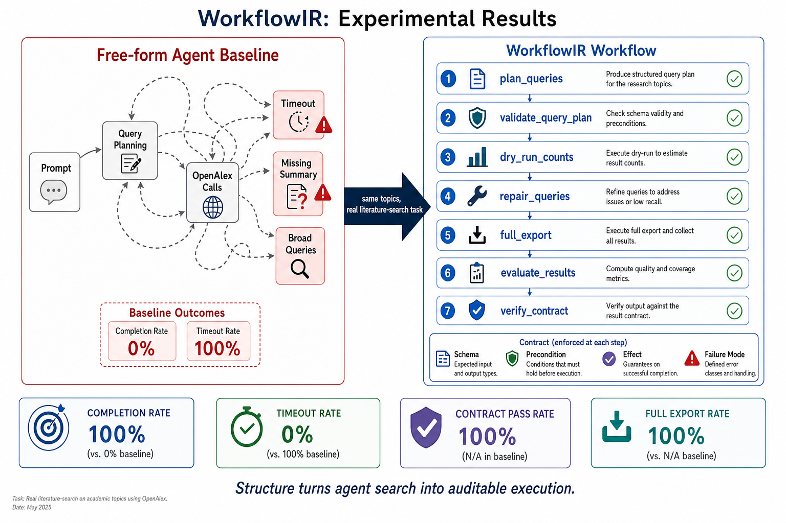
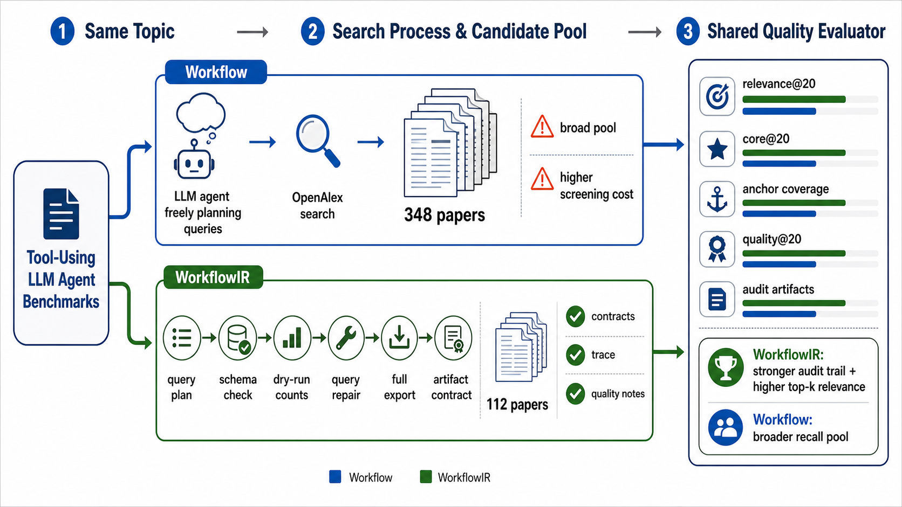

# WorkflowIR: Structured Workflows for Reliable Literature Search

[中文 README](README.md) | [Chinese Introduction](docs/workflowir-cn.md) | [Visual Guide](docs/workflowir_visual_learning.html)

WorkflowIR is an experimental project for studying whether tool-using LLM agents become more reliable when their work is represented as explicit, typed workflows. The current task domain is academic literature search. We compare a free-form prompt agent against a WorkflowIR runner whose nodes carry `schema`, `precondition`, `effect`, and `failure mode` contracts.

WorkflowIR studies one concrete question:

> Can an explicit WorkflowIR contract make tool-using LLM agents more reliable than a free-form prompt?

Academic literature search is a useful stress test because it looks simple but fails in many real ways: over-broad queries, empty queries, missing export files, timeout, ungrounded summaries, and opaque error attribution. WorkflowIR turns the same task into checkable workflow nodes so every step leaves auditable evidence.

This repository is therefore not just a paper-search script. It is a dataset and evaluation scaffold for measuring whether workflow structure improves:

- task completion;
- protocol compliance;
- artifact quality and completeness;
- error attribution;
- recovery from broad, empty, missing, or failed tool calls;
- search-quality differences between Workflow and WorkflowIR on the same topic.





The latest paired-topic experiment compares a free-form Workflow run with a WorkflowIR run on the same literature-search topic, then scores both result sets with the same retrieval-quality evaluator. The report tracks coverage size, top-k relevance, core-paper rate, anchor coverage, quality signals, and audit artifacts:

- [Search-quality comparison report](data/workflowir_litsearch_eval/workflow_vs_workflowir_search_quality_workflow_planning_benchmarks.md)
- [Machine-readable comparison JSON](data/workflowir_litsearch_eval/workflow_vs_workflowir_search_quality_workflow_planning_benchmarks.json)

## What This Project Does

The current reproducible comparison uses two run types: real free-form baseline runs and WorkflowIR workflow runs.

**1. Real baseline agent traces**

A real ARIS/MiniMax/OpenAlex runner asks an LLM agent to solve literature-search tasks. It saves the actual prompts, commands, stdout/stderr, query plans, OpenAlex outputs, summaries, blocked states, timeouts, and trace labels.

Output:

```text
lit-watch/real-agent-trials/
data/real_agent_litwatch_traces/workflowir_seed/
```

**2. WorkflowIR workflow runs**

A WorkflowIR runner executes the same topics as a workflow graph:

```text
create_run
  -> plan_queries
  -> validate_query_plan
  -> dry_run_counts
  -> repair_queries
  -> full_export
  -> evaluate_results
  -> verify_contract
```

The runner validates intermediate artifacts, repairs over-broad or zero-result queries, records node-level failures, and checks that every required output exists.

Output:

```text
lit-watch/workflowir-agent-runs/
data/workflowir_litsearch_eval/
```

## How To Use

From the repository root:

```bash
cd /path/to/WorkflowIR
```

Run the WorkflowIR pipeline in plan-only mode:

```bash
python3 scripts/workflowir/run_workflowir_litsearch_trials.py \
  --config configs/workflowir_litsearch_trials.example.json \
  --max-trials 1
```

Run the WorkflowIR pipeline with real OpenAlex calls:

```bash
python3 scripts/workflowir/run_workflowir_litsearch_trials.py \
  --config configs/workflowir_litsearch_trials.example.json \
  --execute \
  --max-trials 1 \
  --max-results-per-query 50
```

Run real free-form baseline agent trials:

```bash
python3 scripts/workflowir/run_real_litwatch_trials.py \
  --config configs/real_litwatch_trials.example.json \
  --execute \
  --max-trials 5
```

The baseline command invokes ARIS and therefore needs a working ARIS binary plus configured LLM API credentials. The WorkflowIR runner only needs Python and network access to OpenAlex when `--execute` is used.

Compare baseline and WorkflowIR batches:

```bash
python3 scripts/workflowir/analyze_workflowir_litsearch_effectiveness.py \
  --baseline-batch lit-watch/trial-batches/20260505T014639Z-workflowir-real-litwatch-seed/batch_manifest.json \
  --workflowir-batch lit-watch/workflowir-batches/20260505T052451Z-workflowir-workflow-litsearch-seed/batch_manifest.json \
  --out-dir data/workflowir_litsearch_eval
```

Compare Workflow and WorkflowIR search quality on a paired topic:

```bash
python3 scripts/workflowir/evaluate_workflow_vs_workflowir_search_quality.py \
  --workflow-run-dir lit-watch/real-agent-trials/20260505T020439Z-benchmarks-for-tool-using-llm-agents-that-evaluate-dag-planning-executable-workf \
  --workflowir-run-dir lit-watch/workflowir-agent-runs/20260505T052505Z-benchmarks-for-tool-using-llm-agents-that-evaluate-dag-planning-executable-workflows-api-tool-se \
  --output-prefix workflow_vs_workflowir_search_quality_workflow_planning_benchmarks
```

Open the visual explanation:

```text
docs/workflowir_visual_learning.html
```

GitHub Pages:

```text
https://zhuyingqin.github.io/WorkflowIR/
```

## Repository Layout

```text
configs/
  real_litwatch_trials.example.json          real baseline trial topics
  workflowir_litsearch_trials.example.json   WorkflowIR workflow trial topics

scripts/workflowir/
  run_real_litwatch_trials.py                free-form LLM-agent baseline runner
  build_real_litwatch_trace_dataset.py       trace miner for real agent runs
  run_workflowir_litsearch_trials.py         WorkflowIR workflow runner
  analyze_workflowir_litsearch_effectiveness.py
                                             baseline-vs-WorkflowIR comparison
  evaluate_workflow_vs_workflowir_search_quality.py
                                             Workflow-vs-WorkflowIR search-quality comparison
  build_paper_retrieval_db.py                utility for retrieval metadata

scripts/litwatch/
  aris_openalex_lit_watch.py                 ARIS + OpenAlex literature-watch executor
  run_aris_prompt.sh                         helper for direct ARIS prompt runs

scripts/datasets/
  build_aaai2026_awesome_index.py            auxiliary dataset utility
  build_llm_agents_tool_use_collection.py    auxiliary dataset utility
  download_aaai2026_ojs.py                   auxiliary dataset utility
  filter_aaai2026_llm_related.py             auxiliary dataset utility

openalex-search/
crates/runtime/assets/skills/openalex-search/
  reusable OpenAlex export skill and scripts

data/
  real_agent_litwatch_traces/                mined real-agent trace dataset
  workflowir_litsearch_eval/                 comparison reports

docs/
  workflowir-cn.md                           Chinese project introduction
  workflowir_visual_learning.html            GitHub Pages visual walkthrough
  upstream-aris-cn.md                        archived upstream ARIS Chinese README
  upstream-aris-en.md                        archived upstream ARIS English README
```

`idea-stage/` and `research-wiki/` are intentionally ignored and not tracked in Git.

## Current Seed Result

The seed comparison already shows why the structured workflow matters:

```text
Baseline free-form agent:
  completion_rate = 0%
  timeout_rate    = 100%

WorkflowIR workflow agent:
  completion_rate     = 100%
  timeout_rate        = 0%
  contract_pass_rate  = 100%
  full_export_rate    = 100%
```

This supports a reliability claim: WorkflowIR improves completion, artifact contracts, and error attribution for literature-search agents.

The search-quality experiment adds a second claim. WorkflowIR does not necessarily maximize candidate-pool size, but it produces a stronger audit trail and, in the current paired-topic result, higher top-k relevance and combined retrieval-quality scores. The free Workflow run retrieves a broader pool, which can help recall but increases screening cost.

## Upstream Foundation

WorkflowIR is built on top of ARIS-Code, a multi-agent research automation CLI. The original upstream README files were moved out of the repository root so the root README can describe this project directly:

- `docs/upstream-aris-cn.md`
- `docs/upstream-aris-en.md`

ARIS-Code provides the agent runtime, skill system, and literature-search infrastructure used by the real baseline runs.
